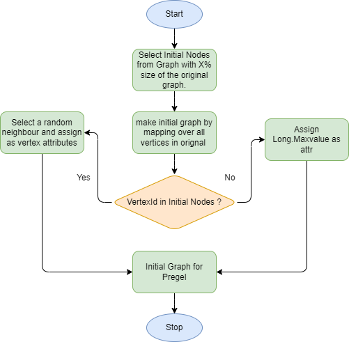
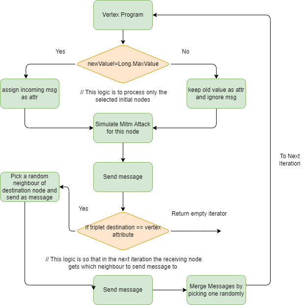
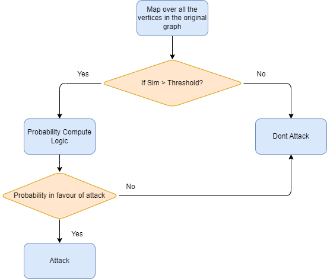

# Algorithms Overview

## Random Walk Algorithm

1. **Initialization**:
    - A list of `initialNodes` is defined, which represents the starting points of the random walk.
    - For these starting vertices, if they have neighbors, a random neighbor is selected as the initial "next step". For all other vertices or those without neighbors, `Long.MaxValue` is assigned, indicating that they're not currently active in the walk.

2. **Pregel API**:
    - The random walk is executed using the Pregel API, which is designed to perform iterative graph computations. The structure of the Pregel call has three main components:

        - **Vertex Program**: This defines what each vertex does when it receives a message:
            - If the vertex receives a valid message (`newValue`), it updates its value to the received message (which is the ID of the next vertex in the walk). If no valid message is received, the vertex retains its previous value (`oldValue`).

        - **Send Message**: This defines the condition under which messages are sent between vertices and what those messages contain:
            - For each edge triplet (source vertex, edge, destination vertex):
                - If the source vertex has a valid value and its value matches the destination vertex's ID (indicating that the random walk is at this destination vertex), then:
                    - The neighbors of the destination vertex are retrieved.
                    - A random neighbor is chosen from these neighbors.
                    - A message containing the ID of this random neighbor is sent to the destination vertex, indicating where the walk should go next.

        - **Merge Message**: If a vertex receives multiple messages (which shouldn't generally happen in this random walk setup), this function defines how to merge those messages:
            - A random message is chosen among the received messages.

3. **Iterations**:
    - The above Pregel process is executed iteratively. At each iteration:
        - Active vertices (those participating in the walk) "decide" their next step by choosing a random neighbor.
        - They then "move" to that neighbor in the next iteration.
    - The iterations continue until either a predefined maximum number of iterations (`5` in this code) is reached or no active vertices/messages remain.

In essence, the random walk algorithm starts at certain nodes (`initialNodes`). In each iteration of the Pregel computation, the walk "moves" to a random neighboring vertex. The Pregel API facilitates this iterative process, allowing vertices to communicate their next step and update accordingly.

---

## Man-in-the-Middle (MitM) Attack Algorithm

### Overview

The algorithm simulates the decisions and outcomes of a MitM attack on a node, comparing it against the original graph. The decisions of whether to attack and the outcomes are influenced by a dynamic probability which depends on the history of successful and failed attacks.

### Steps

1. **Configuration Loading**:
    - The necessary configurations are loaded from a file, giving parameters like similarity thresholds and different probabilities for the attack decision.

2. **Attack Function (`attack`)**:
    - Given two nodes (current and original) and historical attack outcomes, this function decides whether to execute an attack and the outcome of the attack.
    - Steps:
        1. Compute the similarity rank between the current node and the node in the original graph.
        2. Check if the similarity exceeds a given threshold. If it does:
            - Determine the attack probability based on the history of attacks:
                - If both successful and failed attacks are zero, use `initCase` probability.
                - If successful attacks equal failed attacks, use `sucEqFail` probability.
                - If successful attacks are greater than failed attacks, use `sucGtFail` probability.
                - Otherwise, use `sucLtFail` probability.
            - Randomly decide if an attack should be launched based on the calculated probability.
            - If an attack is launched:
                - If the node IDs match and the data is valuable, the attack is deemed **successful**.
                - If the node IDs don't match, but the original node data is valuable, the attack is **failed**.
                - If the node IDs don't match and the original node data isn't valuable, the attack is **uneventful**.
                - If the node IDs match but the data isn't valuable, the attack is **misidentified**.

3. **Simulate Attacks on the Original Graph (`attackingOriginalGraph`)**:
    - Given a node and the original graph, this function tries to simulate an attack on each node of the original graph until a successful attack is made.
    - Steps:
        1. Set the initial state: No attack has been made and initialize counters for different attack outcomes.
        2. For each node in the original graph:
            - If an attack has already been made, continue to the next node.
            - Otherwise, use the `attack` function to decide and execute an attack.
            - If an attack is made, propagate the updated state to the next iteration.
        3. Return the final counts of successful, failed, misidentified, and uneventful attacks.

---

This Man-in-the-Middle attack simulation provides insights into the decisions and outcomes of potential attacks on a node by comparing it to an original graph and considering historical attack outcomes.

